:brazil:
# Visualização de Curvas Implícitas

## Instruções

* A princípio será necessário passar um argumento para que o código rode, esse argumento é igual ao nivel de refinamento inicial, portanto lembre-se que deve ser um valor entre 0-10. Caso o argumento não seja passado, o valor inicial de refinamento da árvore é 9.
* A aplicação só começa a ser responsiva após apertar a tecla P, portanto é ela quem deve ser pressionada primeiro ao rodar a aplicação. 
* A tecla P é responsável pela rotatividade das equações implícitas, cada vez que for pressionada ela vai alterar para a próxima equação das listas de equação, funciona de maneira semelhante a uma lista circular.
* A tecla Q mostra apenas a curva implícita.
* A tecla W mostra a visualização da TAD completa, em todos os seus níveis.
* A tecla E mostra a divisão espacial interna e externa da curva.
* A tecla X aumenta o nível de refino (limite 10).
* A tecla Z diminui o nível de refino (limite 0).

## Curvas implícitas utilizadas

*As funções estão dispostas na mesma ordem da aplicação, sua identificação é crescente da esquerda para direita, de cima para baixo.*

| x³+y-4 = 0 | x⁴+y⁴-xy-8 = 0 | (x²+y²-4)³-x²y³ = 0 |
| :---: | :---: | :---: |
| 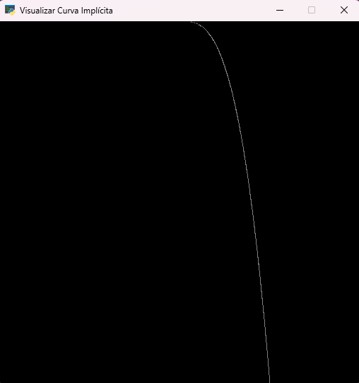 | 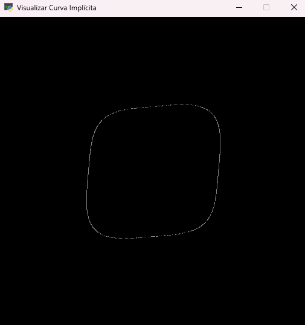 | 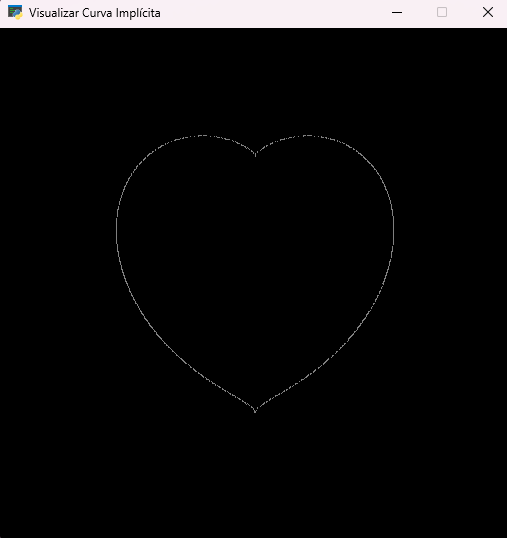 |

| x⁷-y⁵+x²y³-(xy)² = 0 | x²+y²+xy-(xy)²0.5-0.25 = 0 | abs(x)+abs(y)-2 = 0 |
| :---: | :---: | :---: |
| 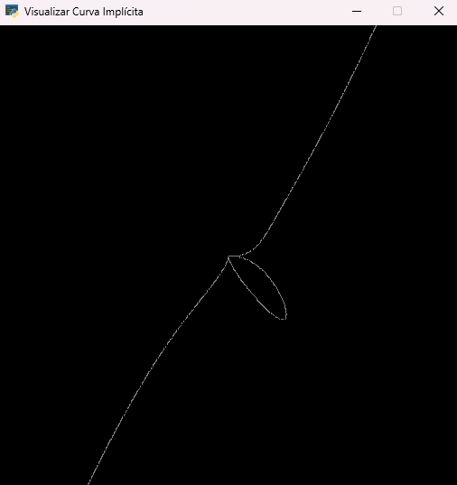 | 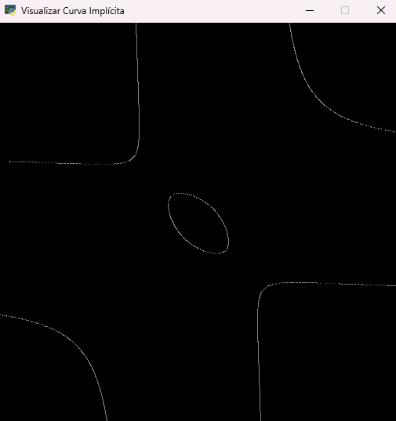 | 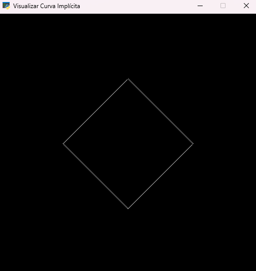 | 

| x³+y²-6xy = 0 | x³+y³-3xy = 0 | (3x²-y²)²y²-(x²+y²)⁴ = 0 |
| :---: | :---: | :---: |
| 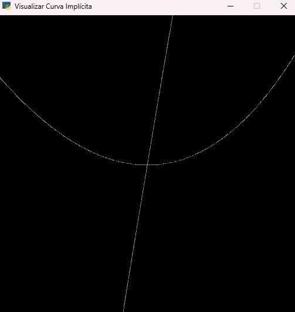 | 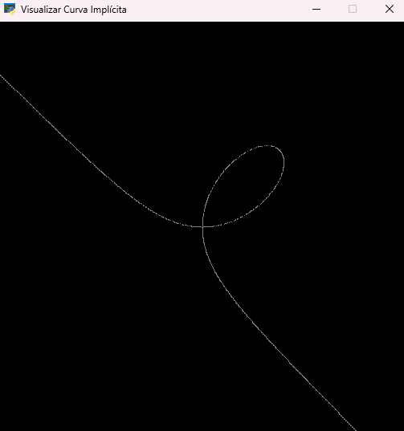 | 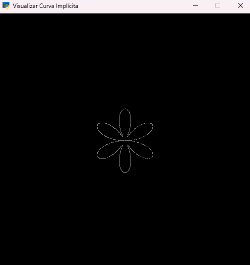 | 

| x²(4-x²)-y² = 0 | y³+y²-5y-x²+4 = 0 | (3x²-y²)y²-(x²+y²)⁴ = 0 |
| :---: | :---: | :---: |
| 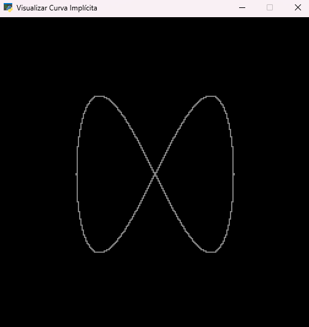 | 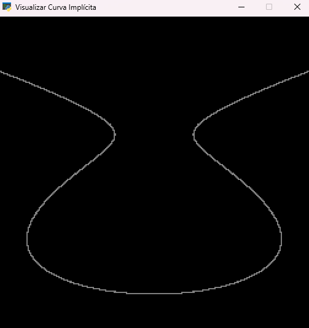 |  | 

## Recomendação de resolução e refinamento
* As imagens ficam mais nítidas em resoluções de potência de 2, no caso 2^n, sendo 0 <= n <= 10.
* As resoluções mais confortáveis são 512x512 com refinamento 9 e 1024x1024 com refinamento 10.
* A grande maioria dos monitores não suporta a resolução de 2048x2048, além disso o grau de refinamento deveria ser maior, necessitando de maiores quantidades de memória e maior tempo para plotagem das curvas.

## Referências bibliográficas
Wikipedia, **Implicit Surface**.https://en.wikipedia.org/wiki/Implicit_surface

pyglet. **pyglet Documentation**.https://pyglet.readthedocs.io/en/latest/

math.toronto. **math.toronto**.http://www.math.toronto.edu/courses/mat237y1/20199/notes/Chapter3/S3.2.html

Geogebra, **Geogebra**.https://www.geogebra.org/classic?lang=pt

ximera, **Implicit Curves and SurfacesMelissa Lynn**.https://ximera.osu.edu/mklynn2/multivariable/content/03_15_tangent_planes/tangent_planes

Shamshad, **Quadtree Algorithm for Implicit Curve Drawing**.http://shamshad-npti.github.io/implicit/curve/2015/10/08/Implicit-curve/

K.G Suffern,**Quadtree Algorithms for Contouring Functions of Two Variables**.https://academic.oup.com/comjnl/article/33/5/402/480353

## 

:us:
# Visualization of Implicit Curves

## Instructions

* It will be necessary to pass an argument for the code runs, this argument is equal to the initial refinement level, so remember that it must be a value between 0-10. If the argument is not passed, the initial value for tree's refinement is 9.
* The application only starts to be responsive after pressing the P key, so it must be pressed first when you start to run the application. 
* The P key is responsible for the rotation of the implicit equations, each time it is pressed it will change to the next equation from the equation lists, it works in a similar way to a circular list.
* The Q key just shows the implicit curve.
* The W key shows all tree's levels.
* The E key shows the inner and outer spatial division of the curve.
* The X key increases the refinement level (limit 10).
* The Z key decreases the refinement level (limit 0).

## Used Implicit Curves

*The functions are arranged in the same order as the application, their identification is increasing from left to right, from top to bottom.*

| x³+y-4 = 0 | x⁴+y⁴-xy-8 = 0 | (x²+y²-4)³-x²y³ = 0 |
| :---: | :---: | :---: |
|  |  |  |

| x⁷-y⁵+x²y³-(xy)² = 0 | x²+y²+xy-(xy)²0.5-0.25 = 0 | abs(x)+abs(y)-2 = 0 |
| :---: | :---: | :---: |
|  |  |  | 

| x³+y²-6xy = 0 | x³+y³-3xy = 0 | (3x²-y²)²y²-(x²+y²)⁴ = 0 |
| :---: | :---: | :---: |
|  |  |  | 

| x²(4-x²)-y² = 0 | y³+y²-5y-x²+4 = 0 | (3x²-y²)y²-(x²+y²)⁴ = 0 |
| :---: | :---: | :---: |
|  |  |  | 

## Resolution and Refinement Recommendations
* Images are sharpest at power of 2 resolutions, in this case 2^n, where 0 <= n <= 10.
* The most comfortable resolutions are 512x512 at refinement 9 and 1024x1024 at refinement 10.
* The vast majority of monitors do not support the 2048x2048 resolution, in addition, the degree of refinement should be greater, requiring greater amounts of memory and more time to plot the curves.

## Bibliographic References
Wikipedia, **Implicit Surface**.https://en.wikipedia.org/wiki/Implicit_surface

pyglet. **pyglet Documentation**.https://pyglet.readthedocs.io/en/latest/

math.toronto. **math.toronto**.http://www.math.toronto.edu/courses/mat237y1/20199/notes/Chapter3/S3.2.html

Geogebra, **Geogebra**.https://www.geogebra.org/classic?lang=pt

ximera, **Implicit Curves and SurfacesMelissa Lynn**.https://ximera.osu.edu/mklynn2/multivariable/content/03_15_tangent_planes/tangent_planes

Shamshad, **Quadtree Algorithm for Implicit Curve Drawing**.http://shamshad-npti.github.io/implicit/curve/2015/10/08/Implicit-curve/

K.G Suffern,**Quadtree Algorithms for Contouring Functions of Two Variables**.https://academic.oup.com/comjnl/article/33/5/402/480353
